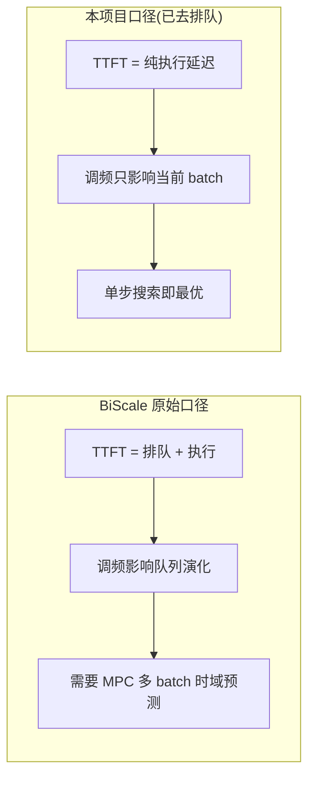

# Baseline DVFS 设计：PD+Tier 与 Native+Tier

本文档说明如何为两个对照 baseline 补齐"调频（DVFS）这一层"，用于和本项目主方案 **PDAF+Tier** 做能效对比。只实现频率调度层，**不实现** reshard / 模型重加载 / 实例伸缩 / pool 合并分裂。

## 一、三方案对照

三者都是"两层"能效框架：Tier 1 做粗粒度资源规划（分钟级），Tier 2 做细粒度 DVFS（毫秒/迭代级）。本项目当前只对比 **Tier 2 调频层**，三者的 Tier 1 都退化为"启动时固定部署 + 锁定基线频率"。

| 维度 | PDAF+Tier（本方案） | PD+Tier（对标 BiScale） | Native+Tier（对标 DynamoLLM） |
|---|---|---|---|
| 架构 | Attention / FFN 算子级分离 | Prefill / Decode 阶段分离 | 不分离，整模型单实例 |
| 部署形态 | PA/PF/DA/DF 多组件 | 多实例 DP，每实例 1P1D（P 1 卡 + D 1 卡） | 多实例 DP，每实例 TP=1 单卡 |
| 路由 | router | round-robin router | round-robin router |
| 频率旋钮 | **两个**：f_A、f_F 独立 | **一个**：每实例整层同频 | **一个**：每实例整模型同频 |
| 控制器 | `AFDVFSController` | `UnifiedDVFSController` | `UnifiedDVFSController` |
| Prefill 调频 | 36 组 (f_A,f_F) 单步搜索 | 6 档单步搜索 | 6 档单步搜索 |
| Decode 调频 | 窗口 + 惰性切换 + V2 耦合模型 | 窗口 + 惰性切换 + KV-util 保护 | 窗口 + 惰性切换 + KV-util 保护 |

DP 多实例的含义（与单一大 TP 区分）：例如 8 卡 Native = 8 个 TP=1 实例 round-robin；8 卡 PD = 4 个 1P1D 实例（每实例 P、D 各 1 卡）round-robin。每个单卡实例**独立运行自己的 Tier 2 控制器**，只锁自己那张卡，互不协同。


## 二、两篇论文的调频层精读

### DynamoLLM（Native 的调频方案）

- 三层控制器：Cluster Manager（实例数 / pool）、Pool Manager（并行度 / reshard）、**Instance Manager（GPU 频率）**。
- 与我们相关的只有最底层 Instance Manager：每个 epoch（约 5s）用性能 profile **先过滤违背 SLO 的频率，再用能耗 profile 选最低能耗频率**。
- 紧急事件处理：队列堆积时重排请求 + 拉满频率（emergency ramp-up）。
- 频率切换开销约 50–80ms（H100，nvidia-smi），靠常驻 nvidia-smi + 特权模式降低。
- 我们采纳的部分：**逐 batch「过滤 SLO → 选最低能耗频率」+ 不满足则拉满**。跳过：pool / reshard / 实例伸缩。

### BiScale（PD 的调频方案）

- 两层；Tier 2 按相位区分控制策略：
  - **Prefill：MPC（模型预测控制）**。因为 TTFT = 排队延迟 + 执行延迟，调频会改变后续 batch 的队列演化，所以在 N 个未来 batch 的时域上预测 TTFT，贪心展开搜索（Algorithm 1）选最低功耗的频率向量。
  - **Decode：逐 batch 轻量搜索**。用 TBT 作为 TPOT 的保守代理，升序选第一个满足 TBT 约束的最低频率；不满足则回退最高频。
  - **KV-util 保护**：decode 降频会延长请求驻留、增大 KV cache，超阈值则强制最高频以加速释放、避免 OOM。
- 频率切换约 tens of ms、TP 各卡不同步，留 5% margin；观测延迟超预测则立刻回满频。
- 我们采纳的部分：**Decode 逐 batch 搜索 + KV-util 保护**；Prefill 见下节说明为何退化为单步搜索。


## 三、关键简化：为什么不实现 Prefill MPC

本项目的 TTFT 指标**已去除排队延迟**，只统计纯处理时间：

```
TTFT_proc = prefill_finished_time - prefill_run_batch_start_time
```

（实现见 `req_time_stats.py` / `tokenizer_manager.py`，version7.md 已切换到此口径。）

BiScale 的 Prefill MPC **唯一存在理由**是：原口径下 TTFT 含排队，调频会改变后续请求的排队演化，必须在时域上预测。一旦排队从 TTFT 中剔除：

- TTFT 只取决于当前 batch 自身的执行延迟；
- 调频不再影响"未来请求的 TTFT"；
- 时域预测 / 队列投影 / 贪心展开搜索全部失去意义；
- Prefill 退化为和 Decode 一样的**单步搜索**：在 `层延迟 × L ≤ TTFT_SLO` 约束下选最低能耗频率。



结论：在本测量口径下，PD 与 Native 两个 baseline 可以**共用同一个统一单旋钮控制器**；不实现 MPC 不是偷工减料，而是口径决定的等价化简。Decode 的 KV-util OOM 保护与排队无关，仍然保留。


## 四、统一单旋钮控制器

实现：`python/sglang/srt/energy/unified_dvfs_controller.py`，类 `UnifiedDVFSController`。

复用现有 `AFProfilePredictor`（不新增 profiling）。PD/Native 单卡上同一层先算 Attention 再算 FFN（串行、同频），所以整层延迟/能耗按同一频率 `f` 把 A、F 相加：

```python
layer_latency = predict_latency(phase, "A", tp, f, ...) + predict_latency(phase, "F", tp, f, ...)
layer_energy  = predict_energy (phase, "A", tp, f, ...) + predict_energy (phase, "F", tp, f, ...)
```

候选频率 `VALID_FREQS = [210, 450, 690, 930, 1170, 1410]`（A800），单卡 `tp=1`。

### Prefill（逐 batch 单步搜索）

```
select_freq_prefill(bs, il, slack_us):
    for f in freqs:                              # 6 档
        if layer_latency("prefill", f) * L > slack_us: continue
        track min energy
    return argmin energy   (无可行 -> F_MAX)
```

slack 用纯处理时间口径：`slack = TTFT_SLO - (now - prefill_run_batch_start)`（见 scheduler `_compute_unified_prefill_slack`）。

### Decode（窗口 + 惰性切换 + KV-util 保护）

```
if kv_util > 0.85: return F_MAX            # OOM 保护，优先于节能
reeval = window_expired / bs_change(>30%) / slo_urgent(>0.9*SLO)
candidates = sort_by_energy(freqs)
for (e, f) in candidates:
    if layer_latency("decode", f) * L > TPOT_SLO: continue
    switched = _should_switch(...)         # 至少差一档 240MHz 且 节能 > 1800mJ 才切
    return f                                # 第一个满足即最低能耗可行解
fallback -> F_MAX
```

窗口大小 `W = max(10, round(10 * 6ms / t_iter))`，保证切频开销 ≤ 10% 窗口时间；惰性切换阈值 `E_SWITCH_MJ = 1800`（≈ 300W × 6ms）。


## 五、系统接入

### Server args（`server_args.py`）

新增与 AFD 平行的一组参数，避免误触发 AFD 路径：

- `--dvfs-enabled`：启用统一单旋钮 DVFS（仅非 AF 实例）。
- `--dvfs-energy-model-dir`：profile pkl 目录（复用 AF 的模型）。
- `--dvfs-ttft-slo-ms` / `--dvfs-tpot-slo-us`：SLO。

### Scheduler（`managers/scheduler.py`）

现状：`_afd_dvfs_before_batch` 只在 `event_loop_afd` 调用；PD/Native 走 `event_loop_normal` / `event_loop_overlap`，原本没有调频钩子。新增：

- `__init__`：当 `dvfs_enabled` 且非 AF perspective 时，构造 `UnifiedDVFSController` + `DVFSController`（锁本进程 `AFD_NVML_DEVICE_INDICES` 指定的卡）。
- `_unified_dvfs_before_batch(batch)`：在两个普通事件循环的 `run_batch` 前调用。
  - **相位判定**：PD 实例用 `disaggregation_mode`（PREFILL→prefill，DECODE→decode）；Native（NULL）用 `batch.forward_mode`（EXTEND→prefill，decode→decode）。
- `_apply_freq_single(f)`：把本实例所有卡锁到同一频率（单旋钮）。
- `_unified_kv_util()`：`1 - available_size / max_total_num_tokens`，供 decode OOM 保护。


## 六、公平性 caveat

去除排队后，控制器可以非常激进地降低 prefill 频率——因为拉长 prefill 执行延迟不再被 TTFT（纯处理）惩罚，但这会间接增加请求排队、压低系统吞吐。需要注意：

- 这是"去排队口径 + 只看处理时间 SLO"的内在副作用，不是 bug。
- **公平性来自一致性**：PDAF+Tier、PD+Tier、Native+Tier 三者全部使用同一 TTFT 处理时间口径、同一 SLO、同一 workload。在相同口径下对比节能与 SLO 违背率是公平的。
- 报告结论时应同时给出**端到端吞吐**与**端到端 TTFT（含排队）**作为辅助指标，避免只看"处理时间 SLO 0% 违背"而忽略吞吐塌陷。
- 若后续要评估排队敏感场景，再补充 queuing-aware DVFS（version7.md 已列为方向），届时三方案同步升级以保持公平。


## 七、测试方法

### 部署矩阵

| 架构 | 无 Tier（满频 baseline） | 有 Tier（DVFS） |
|---|---|---|
| PDAF（本方案） | `pdaf_8g_dyn` / `pdaf_4g_dyn` | `pdaf_8g_dyn_tier` / `pdaf_4g_dyn_tier` |
| PD 分离（DP，1P1D） | `pd_dp4`（8卡）/ `pd_dp2_disagg`（4卡） | `pd_dp4_tier` / `pd_dp2_disagg_tier` |
| Native（DP，单卡） | `native_dp8`（8卡）/ `native_dp4`（4卡） | `native_dp8_tier` / `native_dp4_tier` |

每个 deploy 对应一个完整 QPS sweep；`*_tier` 用 `--freq auto`（由 DVFS 控制），非 tier 用 `--freq max`（锁满频对照）。

### Workload 与 SLO

- Workloads：steady / varying / heavy / overload / tier1_demo（变长，与 version6/7 一致）。
- SLO：示例 TTFT=2000ms（纯处理口径）、TPOT=150ms；可按敏感度需求扫描。

### 采集指标

- TTFT processing (ms，去排队)、端到端 TTFT (ms，含排队，辅助)
- TPOT (ms)、吞吐 (tok/s)
- SLO 违背率（TTFT 为 bool / req；TPOT 为逐 token 百分比）
- 能耗 (J)：P 阶段 / D 阶段分解（PD、PDAF）+ 总能耗
- Tier 节能 % = (无Tier 能耗 − 有Tier 能耗) / 无Tier 能耗

### 运行命令

8 卡（PD/Native baseline，含/不含 Tier，与 PDAF 同 SLO）：

```bash
cd /workspace/sglang-tier/benchmark/energy_bench/scripts/bench
/workspace/env/sglang-tier/bin/python run_8gpu_deploy_bench.py \
  --deploys pd_dp4,pd_dp4_tier,native_dp8,native_dp8_tier,pdaf_8g_dyn,pdaf_8g_dyn_tier \
  --workloads /abs/wl_steady.jsonl,/abs/wl_varying.jsonl,/abs/wl_heavy.jsonl \
  --ttft-slo-ms 2000 --tpot-slo-ms 150 --max-run-s 600
```

4 卡（GPU 4-7）：

```bash
/workspace/env/sglang-tier/bin/python run_4gpu_deploy_bench.py \
  --deploys pd_dp2_disagg,pd_dp2_disagg_tier,native_dp4,native_dp4_tier,pdaf_4g_dyn,pdaf_4g_dyn_tier \
  --workloads /abs/wl_steady.jsonl \
  --ttft-slo-ms 2000 --tpot-slo-ms 150
```

### 验证要点

- tier 实例日志应能看到频率低于满频（降频生效）；非 tier 实例恒定满频。
- 宽松 SLO 下 tier 方案 SLO 违背率应为 0%，且总能耗 < 对应非 tier 方案。
- 对比三架构的 Tier 节能 % 与 P/D 能耗分解，得到 PDAF vs PD vs Native 的能效结论。


